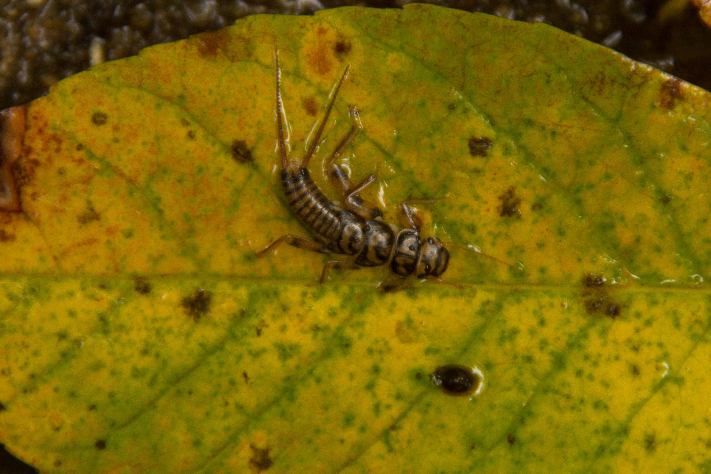

# Final Project -  Biological Integrity in Connecticut Rivers and Streams

## Description
 
### Anticipated title: Biological Integrity in Connecticut Rivers and Streams – 1987 - 2017
### Anticipated subtitle: Clean Water Act implementation progress and needs for continuing success

 *What?* The map will explore changes in biological condition as measured by the benthic macroinvertebrate community at long-term sampling sites in Connecticut.  Benthic macroinvertebrates are animals without backbones, who inhabit the bottom of rivers and streams, as well as many other waterbody types. These organisms are very well studied and have a long history of use as indicators of water quality. Certain types, including mayflies, stoneflies, and caddisflies, can survive only in the cleanest water quality conditions. Other major groups of macroinvertebrates are true flies, beetles, worms, crustaceans, and dragonflies.  Tolerant species are those that can live in highly polluted waters, moderate species can endure a moderate level of pollution, while sensitive species only occur in waters with little to no pollution.  Macroinvertebrate community data will be summarized into metrics that describe the biological condition of the stream.

Changes will be explored in 5 year increments.  Long-term sampling sites are defined as sites that were typically sampled at least once every five years over the period of record (1987 - 2017).  Sites will be excluded from the dataset if a sample was not available in more than one five year period.  Only samples collected with the same sampling methodology (kick-net 2m2) will be used for the analysis.
 
 *Where?*  The map will focus on long-term sampling sites in Connecticut non-tidal rivers and streams.  Long-term sites will be divided into two groups:  historically polluted streams and historic sentinel streams.  Historically polluted streams are those that have been significantly altered due to anthropogenic input and typically a primary focus for restoration as part of the Clean Water Act.  Historic sentinel streams are those that have been least disturbed by anthropogenic input. 
 
 *When?* Available data collected over the past 30 years (1987 – 2017) using a consistent sampling method (kick-net 2 m2) and summarized into 5 year increments.
 
 ## Map objectives and user needs
 
 *Why are you making this map? and Why does the map need to be made?*  Significant progress has been made to clean up rivers since the passage of the federal water pollution control act (commonly known as the clean water act) in 1972.  However, much of the focus has been on fixing waste-receiving streams with overt pollution problems which has left high quality streams vulnerable and open to degradation.   In addition, over the past decade there have been significant cuts to funding and staff for pollution control and science at both the State and Federal levels [(Environmental Integrity Project, 2019)](https://environmentalintegrity.org/wp-content/uploads/2019/12/The-Thin-Green-Line-report-12.5.19.pdf) with further cuts proposed [(U.S. Office of Management and Budget, 2020)](https://www.whitehouse.gov/wp-content/uploads/2020/02/budget_fy21.pdf) threatening continued success of clean water implementation.  This map will seek to demonstrate progress made to date, while at the same time highlighting the need to modernize assessment methods to protect high quality streams from degradation and continue to augment the success of the clean water act.
 
 *Who will use the map?*  Interested stakeholders from NGO watershed groups, water quality managers and potentially legislative decision makers would be likely users of the map.  These users would fall somewhere in the middle of the user motivation vs interface complexity from Roth and Harrower (2008).   These users would likely view the map through a desktop or tablet and use it to identify changes in biological condition statistics over time.  These could be use to defend use of funds to implement the clean water act as well as provide support for need of support / staffing / funds to continue successful implementation.
 
 ## Data Sources
 
 - [Summarized Biological Condition Metrics in Historically Polluted Streams at Long Term Sites](finalPrjData/BCG5_Tier4And5_OverTime.csv)
- [Summarized Biological Condition Metrics in Historic Sentinel Streams at Long Term Sites](finalPrjData/BCG2_Tier2And4_OverTime.csv)
- [Connecticut and Vicinty State Boundary Line](https://portal.ct.gov/DEEP/GIS-and-Maps/Data/GIS-DATA)
- [Connecticut Named Waterbody Line]( https://portal.ct.gov/DEEP/GIS-and-Maps/Data/GIS-DATA)
 
 ## Thematic Representations

The relative abundance (proportion of sample 0 - 1) of tolerant, moderate and sensitive taxa will be displayed using proportional circle symbols on the map (See examples below).

 ### 1989 - 1995 Biological Condition in Waste Receiving Streams
 
 
 ### 2016 - 2017 Biological Condition in Waste Receiving Streams
 

## Anticipated User Interface

The user interface will be a single-paged map.  Users will be able to view changes in the biological condition over time by interacting with a time slider to sequence through 5 year timestamps that display the relative abundance of sensitive, moderate and tolerant species at each point in time.  Users will also be able to resymbolize by toggling between historically polluted streams and historic sentinel streams to highlight the differences in changes that have occurred in each type of stream as a result of clean water act implementation to date.  Users will be able to hover over each site to get name and description of sites and potentially a line or bar chart showing the relative abundance of each species group (sensitive, moderate & tolerant) over the entire period of record.

 ### Mockup Revised ###

## Technology Stack /  Workflow

*Data Processing:* Macroinvertebrate species data at long-term sites will be summarized using the R-statistical programming language and exported as csv files.  State boundary and river layers will be processed (filtered) using QGIS and converted to TopoJSON files using MapShaper.

*Data Format:* Macroinvertebrate data will be stored in csv files and background (state boundary and river layers) will be stored as TopoJSON files.

*JS Libraries:*  JS Libraries will likely include D3, jQuery and Bootstrap

*Other relevant web tech:* HTML, CSS

*Hosting Platform:* GitHub pages (www.github.com/marybecker)

 ## References

Davies S.P., Jackson S.K. 2006. The biological condition gradient: a descriptive model for interpreting change in aquatic ecosystems. EcologicalApplications 16:1251–1266.
 
CT Department of Energy and Environmental Protection Monitoring and Assessment Program.  1987 – 2017. Macroinvertebrate Community Data Collected in High Gradient Rivers and Streams of Connecticut. 

[Connecticut Department of Energy and Environmental Protection. 2015. Ambient Water Quality Monitoring Program Strategy, 2015-2024. Connecticut Department of Energy and Environmental Protection. Hartford, CT 06106.](https://portal.ct.gov/-/media/DEEP/water/water_quality_management/monitoringpubs/monstrategy20152024finalpdf.pdf?la=en)
 
Gerritsen J, Jessup B. 2007. Calibration of the biological condition gradient for high gradient streams of Connecticut. Report prepared for US EPA Office of Science and Technology and the Connecticut Department of Environmental Protection. TetraTech, Maryland 
