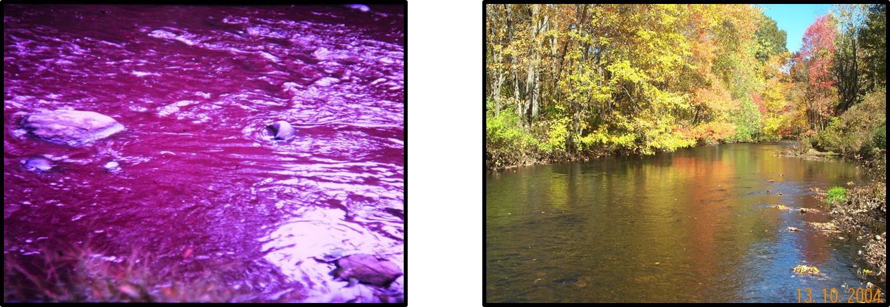
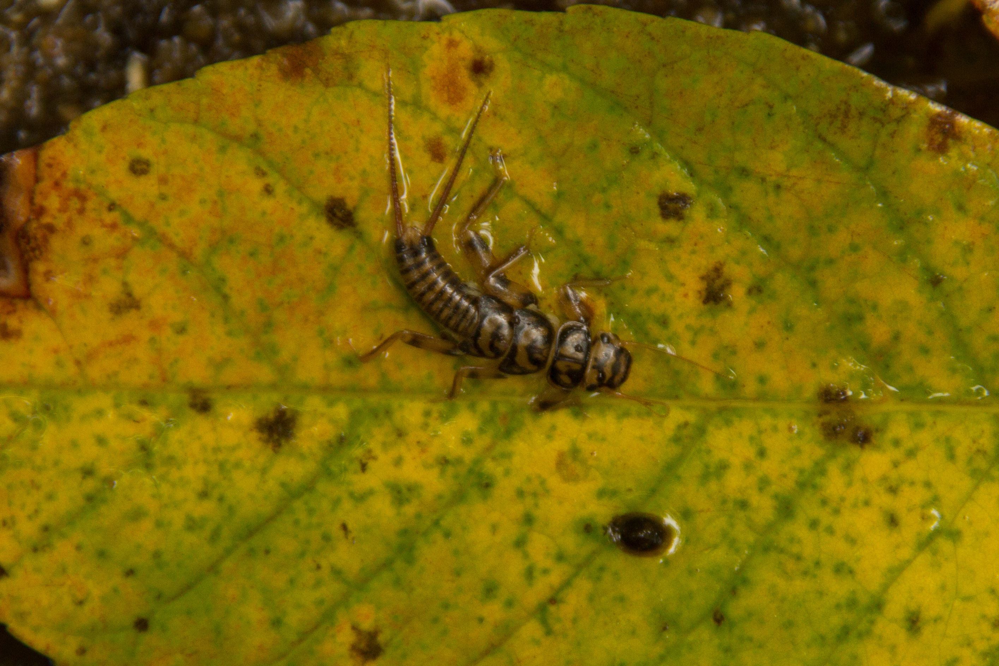
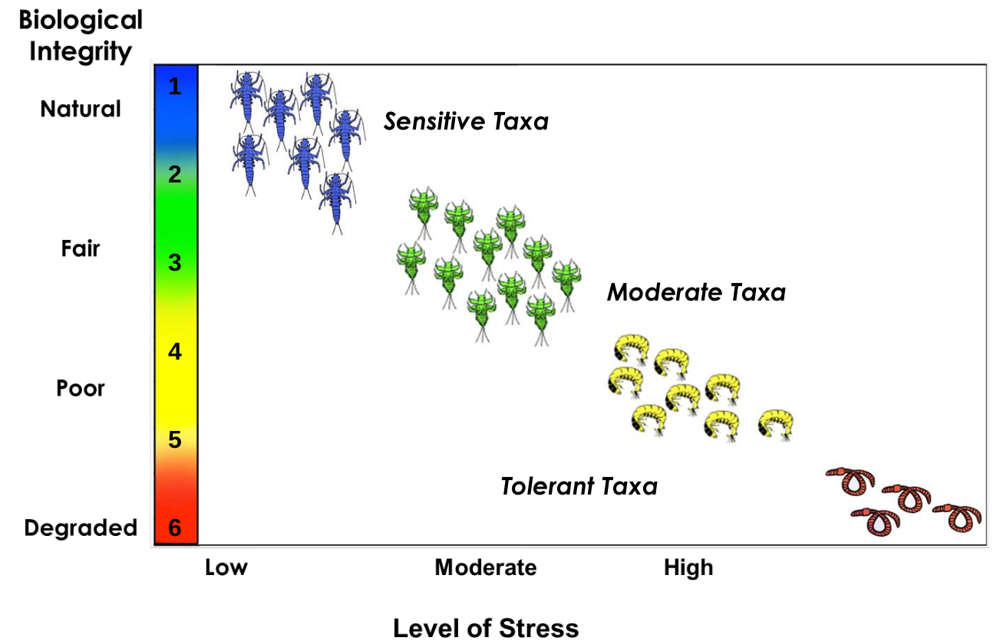

# Biological Integrity in Connecticut Rivers and Streams 1989 - 2017
## Clean Water Act implementation progress and need for continuing success

https://marybecker.github.io/Biointegrity/

### Abstract

Significant progress has been made to clean up rivers since the passage of the federal water pollution control act (commonly known as the clean water act) in 1972.  However, much of the focus has been on fixing waste-receiving streams with overt pollution problems which has left high quality streams vulnerable and open to degradation.   In addition, over the past decade there have been significant cuts to funding and staff for pollution control and science at both the State and Federal levels [(Environmental Integrity Project, 2019)](https://environmentalintegrity.org/wp-content/uploads/2019/12/The-Thin-Green-Line-report-12.5.19.pdf) with further cuts proposed [(U.S. Office of Management and Budget, 2020)](https://www.whitehouse.gov/wp-content/uploads/2020/02/budget_fy21.pdf) threatening continued success of clean water implementation.  This map seeks to demonstrate progress made to date, while at the same time highlighting the need to modernize assessment methods and management efforts to protect high quality streams from degradation and continue to augment the success of the clean water act.

*Willimantic River in Stafford CT the 1960s (left) and 2000s (right)*

The goal of the clean water act is to restore and maintain the chemical, physical, and biological integrity of the Nation's waters.  The focus of the map is the biological integrity of Connecticut’s River and Streams.  Biological integrity is the ability of an aquatic ecosystem to support and maintain a balanced, adaptive community of organisms having a species composition, diversity, and functional organization comparable to that of natural habitats within a region.  The presence, condition, numbers and types of fish, insects, algae, plants, and other organisms provide direct, accurate information about the health of water bodies. Biological assessments measure these factors and are the primary tool used to evaluate the condition of water bodies. Because biological communities are affected by all of the stressors to which they are exposed over time, bioassessments provide information on disturbances not always revealed by water chemistry or other measurements.

*Perlidae (Common Name: Stonefly).  Photo courtesy Peter Zaidel*

 The map explores changes in biological condition as measured by the benthic macroinvertebrate community at long-term sampling sites in Connecticut.  Benthic macroinvertebrates are animals without backbones, who inhabit the bottom of rivers and streams, as well as many other waterbody types. These organisms are very well studied and have a long history of use as indicators of water quality. Certain types, including mayflies, stoneflies, and caddisflies, can survive only in the cleanest water quality conditions. Other major groups of macroinvertebrates are true flies, beetles, worms, crustaceans, and dragonflies.  Tolerant species are those that can live in highly polluted waters, moderate species can endure a moderate level of pollution, while sensitive species only occur in waters with little to no pollution.  Macroinvertebrate community data are summarized into metrics that describe the biological condition of the stream.

*Example of macroinvertebrate taxa along the stream stressor gradient*

Over time, observed tolerant species have decreased while moderate taxa have increased at several historically polluted sites.  However, at several long-term sentinel sites sensitive taxa have decreased while moderate taxa have increased.  This information provides a starting point for water quality managers to reflect on clean water act implementation progress made to date and identify where management practices could change for future implementation.

 ### Methodology

The map includes long-term sampling sites in Connecticut non-tidal rivers and streams.  Long-term sites are divided into two groups:  historically polluted streams and historic sentinel streams (CT DEEP 2015).  Historically polluted streams are those that have been significantly altered due to anthropogenic input and typically a primary focus for restoration as part of the Clean Water Act.  Historic sentinel streams are those that have been least disturbed by anthropogenic input. 

Changes are explored in 5 year increments.  Long-term sampling sites are defined as sites that were typically sampled at least once every five years over the period of record (1987 - 2017).  Sites were excluded from the dataset if a sample was not available in more than one five year period.  Only samples collected with the same sampling methodology (kick-net 2m2) are used in the analysis.
 
Available data was collected by the Connecticut Department of Energy and Environmental Protection Monitoring and Assessment program over the past 30 years (1987 – 2017) using a consistent sampling method (kick-net 2 m2) and summarized into 5 year increments in R.  Metrics were derived using macroinvertebrate biological condition gradient categories described in Gerritsen and Jessup (2007).  The relative abundance (percent of total sample 0 – 100%) of tolerant, moderate and sensitive taxa is displayed using proportional circle symbols on the map (See examples below).  Taxa that were indifferent to pollution stress or were not identified in Gerritsen and Jessup (2007) are labeled as ‘other’.
 
 ### Data Sources
 
 - [Summarized Biological Condition Metrics in Historically Polluted Streams at Long Term Sites](data/BCG_OverTime.csv)
- [Connecticut and Vicinty State Boundary Line](https://portal.ct.gov/DEEP/GIS-and-Maps/Data/GIS-DATA)
- [Connecticut Named Waterbody Line]( https://portal.ct.gov/DEEP/GIS-and-Maps/Data/GIS-DATA)
 
### Technology Stack /  Workflow

*Data Processing:* Macroinvertebrate species data at long-term sites will be summarized using the R-statistical programming language and exported as csv files.  State boundary and river layers were processed (filtered) using QGIS and converted to TopoJSON files using MapShaper.

*Data Format:* Macroinvertebrate data are stored in csv files and background (state boundary and river layers) are stored as TopoJSON files.

*JS Libraries:*  JS Libraries include D3, jQuery and Bootstrap

*Other relevant web tech:* HTML, CSS

*Hosting Platform:* GitHub pages (www.github.com/marybecker)

 ## References

Connecticut Department of Energy and Environmental Protection Monitoring and Assessment Program.  1987 – 2017. Macroinvertebrate Community Data Collected in High Gradient Rivers and Streams of Connecticut. 

Connecticut Department of Energy and Environmental Protection (CT DEEP). 2015. [Ambient Water Quality Monitoring Program Strategy, 2015-2024. Connecticut Department of Energy and Environmental Protection. Hartford, CT 06106.](https://portal.ct.gov/-/media/DEEP/water/water_quality_management/monitoringpubs/monstrategy20152024finalpdf.pdf?la=en)

Davies S.P., Jackson S.K. 2006. The biological condition gradient: a descriptive model for interpreting change in aquatic ecosystems. EcologicalApplications 16:1251–1266.

Environmental Integrity Project. 2019.  [The Thin Green Line: Cuts in State Pollution Control Agencies Threaten Public Health.]( https://environmentalintegrity.org/wp-content/uploads/2019/12/The-Thin-Green-Line-report-12.5.19.pdf) Accessed May 31, 2020.
 
Gerritsen J, Jessup B. 2007. Calibration of the biological condition gradient for high gradient streams of Connecticut. Report prepared for US EPA Office of Science and Technology and the Connecticut Department of Environmental Protection. TetraTech, Maryland.

U.S. Office of Management and Budget. 2020.  [Budget Report Fiscal Year 2021.](https://www.whitehouse.gov/wp-content/uploads/2020/02/budget_fy21.pdf) Accessed May 31, 2020.

*Additional Mapping Projects on CT Water Quality can be found at https://marybecker.github.io/*

